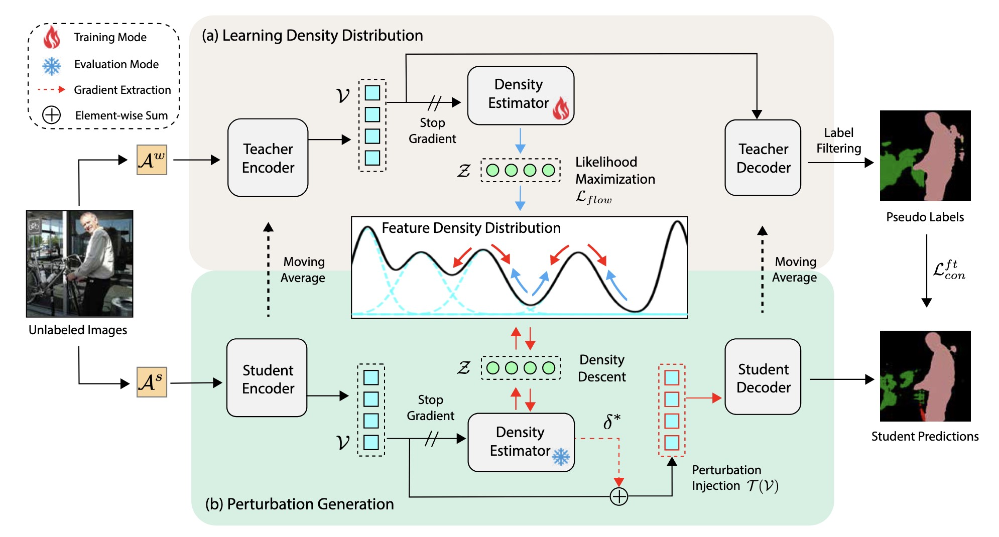

<!-- <div align="center"> -->

## Towards the Uncharted: Density-Descending Feature Perturbation for Semi-supervised Semantic Segmentation

> **[Towards the Uncharted: Density-Descending Feature Perturbation for Semi-supervised Semantic Segmentation](https://openaccess.thecvf.com/content/CVPR2024/papers/Wang_Towards_the_Uncharted_Density-Descending_Feature_Perturbation_for_Semi-supervised_Semantic_Segmentation_CVPR_2024_paper.pdf)**<br>
> Xiaoyang Wang, Huihui Bai, Limin Yu, Yao Zhao, and Jimin Xiao.<br>
> In CVPR 2024.<br>

<div align=center></div><br/>

<!-- [YouTube](https://www.youtube.com/watchwatch?v=o0jEox4z3OI)<br> -->
> **Abstract:** *Semi-supervised semantic segmentation allows model to mine effective supervision from unlabeled data to complement label-guided training. Recent research has primarily focused on consistency regularization techniques, exploring perturbation-invariant training at both the image and feature levels. In this work, we proposed a novel feature-level consistency learning framework named Density-Descending Feature Perturbation (DDFP). Inspired by the low-density separation assumption in semisupervised learning, our key insight is that feature density can shed a light on the most promising direction for the segmentation classifier to explore, which is the regions with lower density. We propose to shift features with confident predictions towards lower-density regions by perturbation injection. The perturbed features are then supervised by the predictions on the original features, thereby compelling the classifier to explore less dense regions to effectively regularize the decision boundary. Central to our method is the estimation of feature density. To this end, we introduce a lightweight density estimator based on normalizing flow, allowing for efficient capture of the feature density distribution in an online manner. By extracting gradients from the density estimator, we can determine the direction towards less dense regions for each feature.*

## Getting Started

### Installation

```bash
cd ddfp
conda create -n ddfp python=3.10
conda activate ddfp
pip install -r requirements.txt
```

### Pretrained Weights

Download pretrained wegiths [ResNet-101](https://drive.google.com/file/d/1Rx0legsMolCWENpfvE2jUScT3ogalMO8/view?usp=sharing)

```
├── ddfp/
    └── resnet101.pth
```

### Data Preparation
<!-- 
- Pascal: [JPEGImages](http://host.robots.ox.ac.uk/pascal/VOC/voc2012/VOCtrainval_11-May-2012.tar) | [SegmentationClass](https://drive.google.com/file/d/1ikrDlsai5QSf2GiSUR3f8PZUzyTubcuF/view?usp=sharing)
- Cityscapes: [leftImg8bit](https://www.cityscapes-dataset.com/file-handling/?packageID=3) | [gtFine](https://drive.google.com/file/d/1E_27g9tuHm6baBqcA7jct_jqcGA89QPm/view?usp=sharing) -->

```
├── Path_to_Pascal
    ├── JPEGImages
    └── SegmentationClass
    
├── Path_to_Cityscapes
    ├── leftImg8bit
    └── gtFine
```


## Training
 
Navigate into `exp/pascal/1464` and modify `config.yaml` and `train.sh` accordingly. By default, model is trained under Distributed Data Parallel mode. 
```
sh train.sh <num_gpu> <port>
```


## Citation
```bibtex  
@inproceedings{wang2024ddfp,
  title= {Towards the Uncharted: Density-Descending Feature Perturbation for Semi-supervised Semantic Segmentation},
  author={Wang, Xiaoyang and Bai, Huihui and Yu, Limin and Zhao, Yao and Xiao, Jimin},
  booktitle={CVPR},
  year={2024},
}
```

## Acknowledgement
This project is inspired by [FlowGMM](https://github.com/izmailovpavel/flowgmm) and our implementation borrows codes from [FrEIA](https://github.com/vislearn/FrEIA) and [UniMatch](https://github.com/LiheYoung/UniMatch). We thank them for their effort in open-sourcing and maintaining the codes.


## Contact
For questions, please contact: wangxy@liverpool.ac.uk


## Update
Current repo requires further modifications and will be fixed and tested shortly.